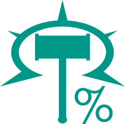
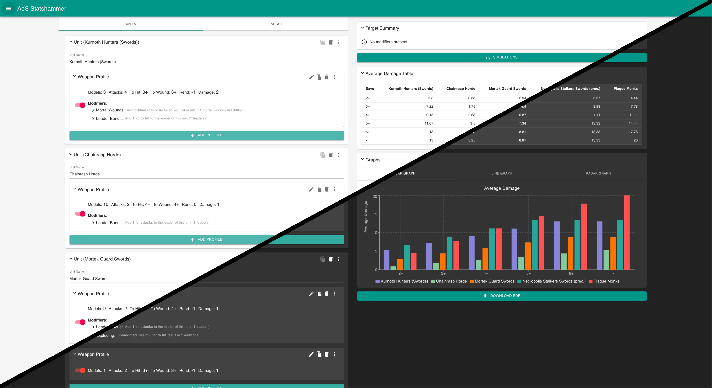

<div align="center">
    <a href="https://aos-statshammer.herokuapp.com/" target="_blank">
        
    </a>
</div>

# Age of Sigmar Statshammer

A tool for calculating and comparing damage outputs for Warhammer Age of Sigmar units
(also referred to as Mathhammer).

The production deploy of the tool is located at: https://aos-statshammer.herokuapp.com/

The tool works by adding a number of weapon profiles to various units, which can contain
a number of modifiers (abilities)

<div align="center">
    <a href="https://aos-statshammer.herokuapp.com/" target="_blank">
        
    </a>
</div>

## Features

- **Average Damage Stats**
  - Gather the average damage that each unit is expected to do against each possible save.
  - This average is a calculated value (not simulated)
  - The average damage is presented the following forms:
    - Table
    - Bar Graph
    - Line Graph
    - Radar Graph
- **Profile Modifiers**
  - Add various modifiers, or abilities, to your weapon profiles in order to replicate the vast array of unit rules/abilities.
  - Some examples are:
    - 'Deal `x` Mortal Wounds on a roll of `y`'
    - 'Rerolls'
    - 'Leader Bonuses'
- **Target Modifiers**
  - Add various modifiers, or abilities, to the target to which stats are generated against (the opponents unit).
  - Some examples are: 
    - 'Ethereal' 
    - 'Rerolls'
    - 'Negate wounds and mortal wounds on a roll of `y`'
- **Simulations**
  - Generating `x` simulations to gather the following:
    - **Discrete** Probabilities
    - **Cumulative** Probabilities
    - Various **Sample Metrics** (mean, max, variance, etc.).
  - The number of simulations is customizable from the simulations screen.
- **Import/Export JSON**
  - Save your crafted units so that you can re-import them later
- **Export PDF**
  - Export the full stats, as well as, simulations to PDF form
- **Dark Theme**
- **Persisitent data between refreshes**
- **And more**
  - Keep an eye on the [Github Releases](https://github.com/damonhook/aos-statshammer/releases),
    or the [SubReddit](https://www.reddit.com/r/AoSStatshammer/) to get notified of new additions

## Roadmap Features

- Ability to add modifiers to the unit as a whole, and not just to each profile
- Ability to provide points costs to provide stats for average damage / 100 points

## Related Projects
- [Warcry Statshammer](https://warcry-statshammer.herokuapp.com/)

## Installation

Ensure that you have `node`, `yarn`, and `nodedeamon` installed.

Install the packages needed for the express server (backend) and the client (frontend)

```bash
yarn setup
```

## Usage

### `yarn dev`

Runs the app in development mode (launches both the express server, and the react frontend).

Open http://localhost:3000 to view it in the browser

### `yarn test`

Runs the api tests. Please make sure you run this whenever you make any changes to the api / backend

### Contributing

Pull requests are welcome. For major changes, please open an issue first to discuss what you would like to change.

If you make any changes to the API. Please ensure that you have run the unit tests. In addition, if you have added extra functionality to the API (e.g: a new modifier), please add a unit test to the `api/tests/test.units.ts` file that contains this new functionality
